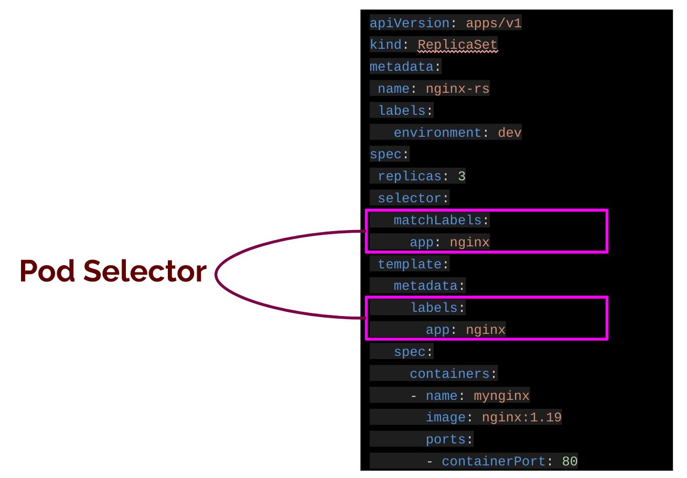

## ReplicaSets

- Create yaml file named `myreplicaset.yaml`.

`cat << EOF > myreplicaset.yaml
apiVersion: apps/v1
kind: ReplicaSet
metadata:
  name: nginx-rs
  labels:
    environment: dev
spec:
  replicas: 3
  selector:
    matchLabels:
      app: nginx
  template:
    metadata:
      labels:
        app: nginx
    spec:
      containers:
      - name: mynginx
        image: nginx:1.19
        ports:
        - containerPort: 80
EOF`{{copy}}

- Create the replicaset with `kubectl apply` command.

`kubectl apply -f myreplicaset.yaml`{{copy}}

- List the replicasets.

`kubectl get replicaset`{{copy}}

- List pods with more information.
  
`kubectl get pods -o wide`{{copy}}

- Show details of replicasets.

`kubectl describe replicaset <replicaset-name>`{{copy}}

- Delete replicasets

`kubectl delete replicaset <replicaset-name>`{{copy}}

### Pod Selector

The .spec.selector field is a label selector. 

The `.spec.selector` field and `.spec.template.metadata.label` field must be same.

